<div align="center">

# 100-Day DevOps & Cloud Engineering Lab

<p align="center">
  <b>A disciplined 100-day break-fix curriculum building and troubleshooting production cloud infrastructure from scratch: self-contained modules, zero tutorial clones, real Root Cause Analysis (RCA), and a verified $0 AWS billing footprint.</b>
</p>

[](https://github.com/prathameshlonare)
[](#curriculum-roadmap)
[](#the-break-fix-engine)
[](#the-break-fix-engine)

<p align="center">
  <a href="#the-break-fix-engine">Break-Fix Engine</a> •
  <a href="#curriculum-roadmap">Curriculum Roadmap</a> •
  <a href="#daily-module-architecture">Daily Architecture</a> •
  <a href="#exploring--running-labs">Exploring Labs</a> •
  <a href="#engineering-standards">Engineering Standards</a> •
  <a href="#author--connect">Connect</a>
</p>

</div>

<br />

## The Break-Fix Engine

Every single day abandons passive video consumption and follows a strict six-step operational cycle:

```mermaid
flowchart LR
    Build["1. Provision Infra<br/>(AWS eu-north-1 / Linux)"] --> Break["2. Fault Injection<br/>(Drop ports, corrupt state, deny IAM)"]
    Break --> Triage["3. Root Cause Analysis<br/>(journalctl, ss, CloudWatch, strace)"]
    Triage --> Fix["4. Production Fix<br/>(HCL refactor, ACL rule, rollback)"]
    Fix --> Doc["5. Post-Mortem & Quiz<br/>(RCA doc, verification, quiz scenario)"]
    Doc --> Teardown["6. Complete Teardown<br/>($0 billing footprint verified)"]

    style Build fill:#161b22,stroke:#0ea5e9,stroke-width:2px,color:#fff
    style Break fill:#161b22,stroke:#f43f5e,stroke-width:2px,color:#fff
    style Triage fill:#161b22,stroke:#f59e0b,stroke-width:2px,color:#fff
    style Fix fill:#161b22,stroke:#22c55e,stroke-width:2px,color:#fff
    style Doc fill:#161b22,stroke:#a855f7,stroke-width:2px,color:#fff
    style Teardown fill:#161b22,stroke:#64748b,stroke-width:2px,color:#fff
```



| Operational Stage | Hands-on Engineering Action | Technical Verification Standard |
| :--- | :--- | :--- |
| **1. Fresh-Start Build** | Provision isolated infrastructure in AWS (`eu-north-1`) or local Linux. | Hand-coded HCL/Shell; no click-ops console dependencies. |
| **2. Fault Injection** | Simulate production failure modes under real runtime conditions. | Port blocks, IAM denial policies, corrupted remote states. |
| **3. Root Cause Analysis** | Isolate root failure through kernel logs, packet analysis, and metrics. | Evidence captured via `journalctl`, `ss`, `strace`, and CloudWatch. |
| **4. Production Fix** | Implement least-privilege, idempotent remediation code. | Validated via `terraform plan`, unit tests, or packet return flows. |
| **5. Post-Mortem & Quiz** | Document technical post-mortem and scenario-based quiz questions. | Explaining root causes line-by-line without hand-waving. |
| **6. Total Teardown** | Automate immediate destruction of all provisioned cloud resources. | Verified \$0 billing footprint with hard AWS billing alarms. |

---

## Curriculum Roadmap

The complete 100-day curriculum spans 10 progressive phases, taking fundamentals from the Linux kernel to multi-tier Kubernetes clusters and production SRE drills:

| Phase | Core Engineering Domain | Span | Key Production Competencies Mastered | Status |
| :---: | :--- | :---: | :--- | :---: |
| **01** | **Linux Systems & Networking** | Days 01–07 | FHS hierarchy, ACL permissions, systemd service triage, iptables packet drops | `Completed` |
| **02** | **Git Mastery & Version Control** | Days 08–11 | Fast-forward merges, 3-way conflict resolution, detached HEAD recovery | `Completed` |
| **03** | **Containers & Multi-Stage Builds** | Days 12–16 | Dockerfile hardening, multi-stage caching, bridge networks, volumes | `Completed` |
| **04** | **CI/CD Automation Pipelines** | Days 17–19 | GitHub Actions workflows, secrets handling, Trivy container security scans | `Completed` |
| **05** | **AWS Fundamentals & Terraform** | Days 20–30 | VPC topology, SG vs NACL, S3 state locking, dynamic modules, tfvars | `In Progress` |
| **06** | **Kubernetes Support & Orchestration** | Days 31–48 | Pod scheduling, CrashLoopBackOff triage, Services, Ingress, Helm | `Planned` |
| **07** | **Production Capstone Rebuild** | Days 49–58 | Complete hand-written infra rebuild of past serverless platforms | `Planned` |
| **08** | **Monitoring & Observability** | Days 59–67 | CloudWatch alarms, synthetic monitoring, log aggregation, Prometheus | `Planned` |
| **09** | **Production Drills & Verbal RCA** | Days 68–75 | Live mock interview break-fix triage, architectural tradeoffs | `Planned` |
| **10** | **SRE & Job Acceleration** | Days 76–100 | Targeted Cloud Ops / Support applications, live technical screens | `Planned` |

---

## Daily Module Architecture

Every day's directory in this repository is completely self-contained. Navigate directly into any `day-XXX/` folder above to inspect:

```text
day-XXX/
├── day-XXX.md             # Core build guide, failure injection, and Root Cause Analysis (RCA)
├── day-XXX-quiz.md        # Scenario-based technical assessment quiz (5 scenario-heavy questions)
├── day-XXX-interview.md   # Verbal RCA interview defense drill (where applicable)
└── <lab-code>/            # Hand-crafted Terraform modules, Dockerfiles, or bash automation
```

### Navigating Days
GitHub automatically lists all 100 daily directories above in chronological order (`day-001/` through `day-100/`). Simply click into any daily folder to access the complete lesson, break scenario, and lab artifacts.

---

## Exploring & Running Labs

Every module includes reproducible code and explicit teardown instructions.

### Prerequisites
- **AWS CLI v2** configured with Free Tier credentials (`eu-north-1`).
- **Terraform >= 1.5.0** and **Docker Engine >= 24.0.0**.
- **Ubuntu / Debian / WSL2** environment with standard networking utilities (`ss`, `curl`, `dig`, `ip`).

### Execution Pattern

```bash
# 1. Enter any targeted lab directory
cd day-XXX/<lab-directory>

# 2. Inspect the failure scenario and triage plan
# Read day-XXX.md for the injected fault, symptom observations, and RCA logs

# 3. Initialize and deploy isolated infrastructure (e.g., Terraform labs)
terraform init
terraform plan
terraform apply -auto-approve

# 4. Perform the investigation and verify the fix
# Follow the diagnostic commands outlined in Part 3 and Part 4 of the lesson

# 5. Execute full teardown to guarantee a $0 billing footprint
terraform destroy -auto-approve
```

---

## Engineering Standards

Every single module in this repository was completed under three non-negotiable rules:

1. **Zero Click-Ops & Line-by-Line Defense**: No black-box AI code. Every line of Terraform, Dockerfile instruction, and shell script is written by hand and defended technically.
2. **Fresh-Start Isolation (`eu-north-1`)**: Each AWS lab provisions its own isolated VPC with unique CIDR blocks (`10.NN.0.0/16`) to guarantee reproducible, collision-free triage.
3. **Hard \$0 Cost Discipline**: Metered cloud resources (NAT Gateways, load balancers, EC2 instances) are destroyed immediately upon lab completion, verified against automated \$5 AWS billing alarms.

---

## Author & Connect

**Prathamesh Lonare**  
Associate DevOps / Cloud Engineer (B.Tech CSE '26)  
- **LinkedIn**: [linkedin.com/in/prathamesh-lonare21](https://www.linkedin.com/in/prathamesh-lonare21/)  
- **Portfolio**: [prathameshlonare.me](https://prathameshlonare.me)  
- **GitHub**: [github.com/prathameshlonare](https://github.com/prathameshlonare)  

> *"You're someone who builds systems, breaks them, and learns from the wreckage."*
